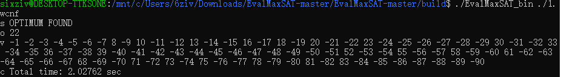
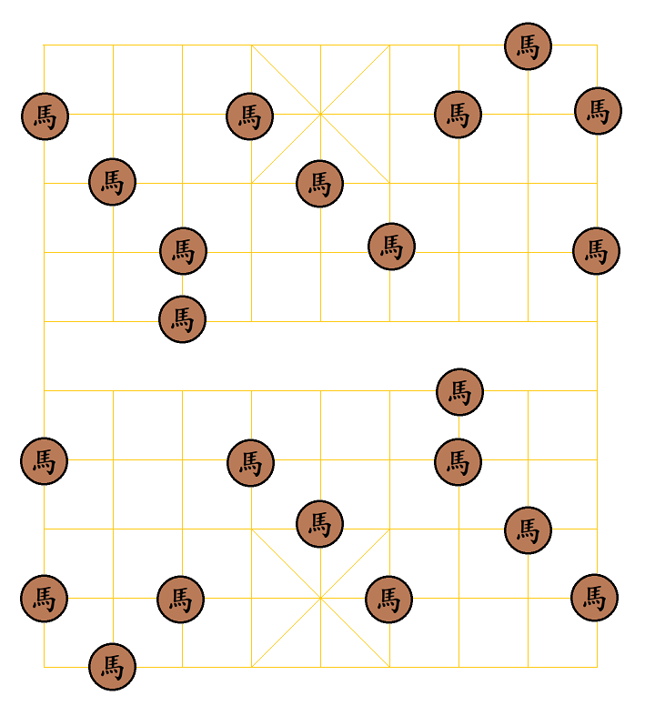

### 算法第二次作业——中国象棋棋盘上的马控制问题 

#### 问题描述

在中国象棋的棋盘上，摆放且仅仅摆放若干个棋子“马”。问至少需要摆放多少个“马”，才能保证棋盘上的每一个位置，要么被“马”占据，要么正在被“马”攻击。

这个问题在网络上得到了一定的讨论。如[此页面](https://tieba.baidu.com/p/848740318?red_tag=2069887047)和[此页面](https://www.zhihu.com/question/279742785)下，都对这一问题进行了一定的讨论。其中提出的解决方案，主要是基于搜索和dp两种。而搜索的时间复杂度相对较大；dp则实现起来相对繁琐，而且可扩展性也相对较差。

选择这一问题的原因在于：一方面，这一问题本身相对较为复杂，已知的其它做法的时间开销较大，不能很好地解决这一问题；另一方面，有其他人得到的结论作为参考，可以用来确认我们对问题进行转换与求解过程的正确性。

接下来，我们试图通过将问题转换为MaxSAT问题，并通过求解器对问题进行求解。

#### 实验内容

我们使用[EvalMaxSAT](https://github.com/FlorentAvellaneda/EvalMaxSAT)对问题进行求解。为此，我们需要将问题转换为MaxSAT问题。

对于棋盘上的每一个点，将它视为一个布尔变量，用来表示这个点所在的位置是否摆放了棋子“马”。那么，一个点被控制，等价于这个点所在的位置摆放了棋子“马”，或者某个能攻击到这个点的位置摆放了棋子“马”，且“蹩腿”的位置没有摆放棋子。

将$(x,y)$点对应的变量记作$a_{x,y}$，那么，点$(x,y)$ 能够被控制，实际上就等价于$a_{x,y}\or\left(\bigvee\limits_{dx\in\{-1,1\},dy\in\{-1，1\}} a_{x+dx,y+dx} \and \left(a_{x+2dx,y+dy}\or a_{x+dx,y+2dy}\right)\right)$，其中不在棋盘范围内的变量都取值为假，并从最终的公式中略去。

可以应用Tseitin变换将上式转换为合取范式。这里我们可以利用上面公式的形式，不实现完整的Tseitin变换算法，而仅仅利用$\or$和$\and$算符之间的分配律，对形如具有”布尔变量的析取的合取的析取“形式的约束条件进行转写。

考虑“合取的析取”，我们从它的每一个合取子句中取一个文字，从而构成一个析取子句。取所有这样析取子句的合取，即与原命题等价。方便起见，我们用0-1变量的加法和乘法表示布尔变量$\or$和$\and$。例如$ab+cd$和$(a+c)(a+d)(b+c)(b+d)$是等价的。

因此，我们可以从前向后依次对约束条件进行改写，最终将整个约束条件改写为合取范式。

理论上，我们还可以通过奎因算法等方式对约束条件进行简化。但是考虑到约束条件本身的形式不是很复杂，在这个问题中没有很大必要进行简化。

整张棋盘被控制，可以被描述为棋盘上的点分别被控制的合取。既然每个点被控制都能够被写成合取范式，那么整张棋盘被控制自然也就被写成了合取范式的形式。

至此，我们得到了用合取范式形式描述的”棋盘被控制“这一约束。我们将它作为MaxSAT问题中的”硬约束“。

另一方面，我们希望使用尽可能少的棋子。因此，我们添加若干条”软约束“，试图约束每一个点对应的布尔变量取值为假。这样，如果求得的解使得尽可能多条软约束被满足，那么它也就使得尽可能少的位置上被放置了棋子，即使用了尽可能少的棋子。

因为EvalMaxSAT默认对”带权值的MaxSAT问题“进行求解，所以只要为每一条软约束指定相同的权值即可。

我们将约束条件以wcnf格式进行输出，关于格式的定义可以参考[MaxSAT Evaluation](https://maxsat-evaluations.github.io/2022/rules.html)中给出的例子（pre-2022），并通过EvalMaxSAT进行求解。

如图所示，程序可以在数秒内完成运算，这远远快于使用搜索进行计算的用时。

对于插头DP算法，因为“马”所具有的横跨五行的攻击范围，我认为算法用到的状态表大小在数量级上不会少于棋盘上四行布尔值的所有取值可能，乘上棋盘行数，即$2^{36}\times 10$。哪怕忽略后者，以及填充这一表格时需要的检查操作带来的巨大的时间消耗，也能看出来，插头DP的性能不是非常理想。

在上面提到的两个问题下，由网友提供的数据也可以印证这一点——根据实际测试的结果，插头dp往往也需要以小时计的时间来完成遍历。

由此看来，使用MaxSAT问题的求解器对这一问题进行求解，在时间效率上是有着不小的优势的。

我们将上面程序输出的解绘制在棋盘上，从左上角开始，棋盘上的点被逐行依次编码为1，2，3，…，正数代表这个点上放置了棋子“马”，负数代表这个点为空。绘制出来的结果如图所示。可以检查，它确实是能够让棋盘被马控制的一种布局方式。

#### 相关代码

生成wcnf文件用到的代码已经被上传至[github仓库](https://github.com/6ziv/algo_homework_attachment)。

所使用的求解器可以从[这里](https://github.com/FlorentAvellaneda/EvalMaxSAT)获取，并按照其说明中给出的方式进行编译。
